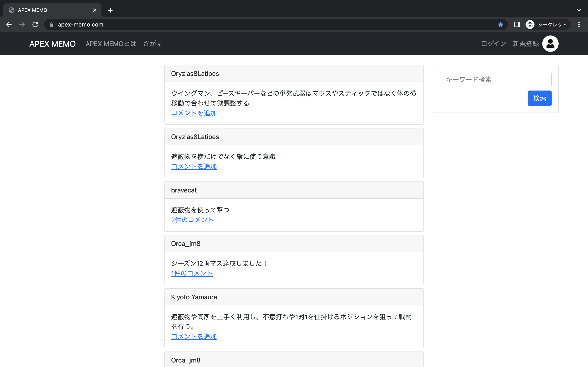

# APEXプレイヤー向けSNS APEX MEMO

APEXがもっと上手くなりたい、やってるけど最近あまり上手くならないなという方に向けた技術の言語化とプレイヤー同士の交流を目的としたメモ×掲示板のようなアプリです。

URL:https://apex-memo.com

## 解説記事(Qiita)
URL: https://qiita.com/Orca-jm8/items/5ab1b96f4345e3b685a7

## 使用技術
* フロントエンド
    * HTML/CSS
    * Bootstrap
    * JavaScript
    * jQuery

* バックエンド
    * PHP 7.4.28
    * Laravel 6.20.44
    * PHP_CodeSniffer(コード解析ツール)

* インフラ・開発環境
    * Docker/Docker-compose
    * AWS(ECR,ECS,VPC,S3,Route53,NLB,RDS,ACM,SSM)
    * CircleCI(CI/CD)

## インフラ構成図

